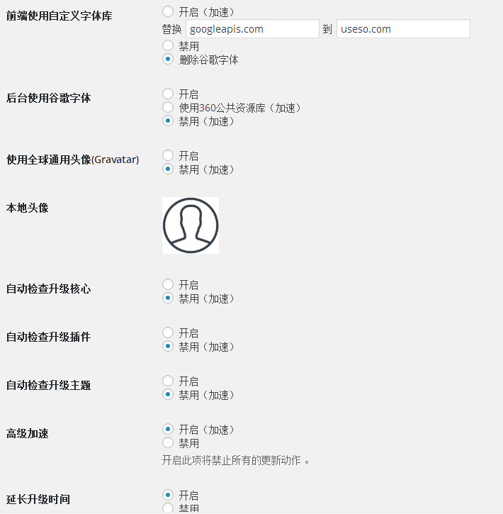

# 解决wordpress插件composer的若干问题
---
composer是一个非常实用的可视化编辑器，在天朝总是因为各种问题，导致访问过慢等问题。
## 解决wordpress加载缓慢
1. 首先，解决wordpress较慢问题，360替换google的插件貌似最近没有效果，而且出现了访问量过大须输入验证码继续访问，据说最近fonts.googleapis.com可以正常访问了，但是ajax.googleapis.com仍然无法访问。

2. 所以最近使用的是QQ world-speed-for-china插件，直接在后台删除谷歌字体等。

3. 这些问题解决后发现还有一个问题，就是打开文章页，加载composer时仍然十分缓慢，需要1-2min，打开开发者工具查看是一个谷歌的资源链接webfont1.4.7加载不了导致的，所以找到加载该资源链接的文件对其进行修改（本人用VPN将文件保存在本地了webfont.js）：
		js_composer/include/classes/editors/class-vc-backend-editor.php
在253行找到
		wp_register_script( 'webfont', '//ajax.googleapis.com/ajax/libs/webfont/1.4.7/webfont.js' ); // Google Web Font CDN
将其修改为：
		wp_register_script( 'webfont', '/wp-content/plugins/js_composer/assets/js/webfont.js' ); // 本地资源 Web Font
## 解决composer无法正常使用
有时候发现，安装好了插件点击composer的组件没有反应，打开控制台，发现报错，$template.get()函数不存在。
1. 找到对应文件js_composer/assets/js/backend/composer-view.js
2. 在第99-116行更改函数html2element
		html2element:function (html) {
            var attributes = {},
                $template;
            if (_.isString(html)) {
                this.template = _.template(html);
               $template = $(this.template(this.model.toJSON()).trim());
            } else {
                this.template = html;
                $template = html;
            }
			_.each($template.get(0).attributes, function (attr) {
                attributes[attr.name] = attr.value;
            });
            this.$el.attr(attributes).html($template.html());
            this.setContent();
            this.renderContent();
        },
将其改为：
		html2element:function (html) {
            var attributes = {},
                $template,

                template = html;
			 $template = $(template(this.model.toJSON()).trim());

            _.each($template.get(0).attributes, function (attr) {
                attributes[attr.name] = attr.value;
            });
            this.$el.attr(attributes).html($template.html());
            this.setContent();
            this.renderContent();
        },
保存刷新，本教程针对The7主题下内嵌的composer有效，稍后增加composer完整插件的解决方法。